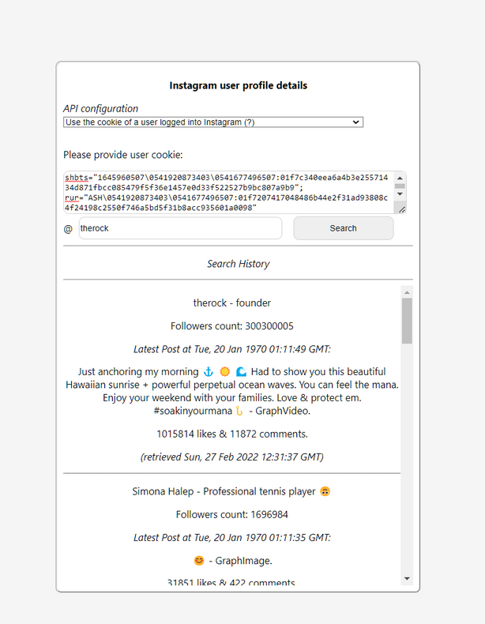

## Instagram profile parser

## Project description
The goal of this project is to implement a full stack solution for parsing an instagram user profile data using the available public API. 
## Tech Stack
- Frontend: Typescript, React
- Backend: Typescript, Nodejs, Express
## Build and run
  #### Prerequisites: `docker`
  ### Run backend & frontend apps:
  ```
  docker-componse up -d
  ```
  Access the ui at http://localhost:3000/. Default configurations like ports may be changed in the root `.env` file.

  #### Clean up:
  ```
  docker-compose down --rmi all
  ```

  (For more indepth info, consult the README of both services).


## Product requirements

Using Instagram's public, rate-limited API that returns a JSON response, retrieve user profile information based on an input handle (instagram username). To retrieve an account, for instance, append ?__a=1 to the URL.
- Account: https://www.instagram.com/simonahalep/?__a=1
- Post: https://www.instagram.com/p/CZ9zjX3jI_l/?__a=1

## Further improvements
- return the profile image as base64 encoded from the server to workaround the same-origin-policy
- introduce caching for the instagram profile call
- find a solution to better scale the rate limiting mitigations
